 

---

## About

Software engineer focused on **software design and functionality**

- **2+ years** shipping production software with state-of-the-art stacks.
- **~10 years** exploring the craft end to end: full-stack, DevOps, architecture,
  cloud, machine learning, infrastructure & network administration, and
  **agentic AI architectures**.
- Design mindset first: clear boundaries, testability, and long-term maintainability
  over quick fixes.
- Comfortable across the **observability** loop — metrics, logs, traces and
  dashboards — with hands-on **Amazon CloudWatch**.

> Currently preparing the **AWS Certified Solutions Architect – Associate** certification.

---

## Technologies I've worked with

